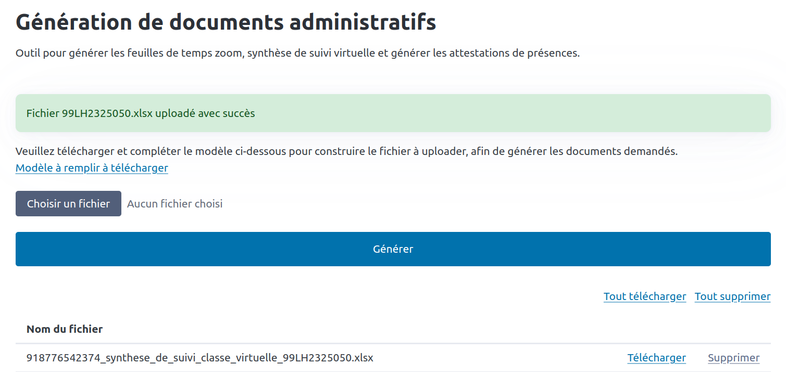

# [Ekoforma] Generate adminisrative doc


## Installation

> Create virtual environments
```sh
 python -m venv venv
```

> Activate virtual environment
```sh
source venv/bin/activate 
```

> Install packages with pip
```sh
pip install -r requirements.txt
```

### Application console
> Execute
```sh
python console.py
```


### Application web
> Execute
```sh
flask --app app run
```



## Environnement

* Production: https://app-generate-doc-f2b71d88da7a.herokuapp.com
* Local: http://localhost:5000